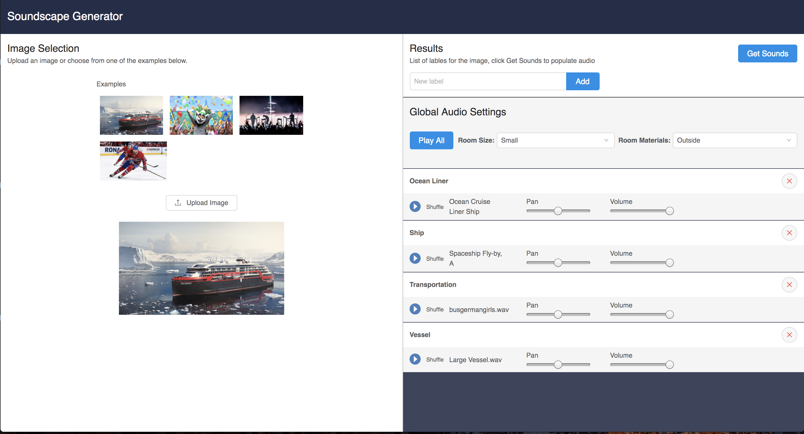
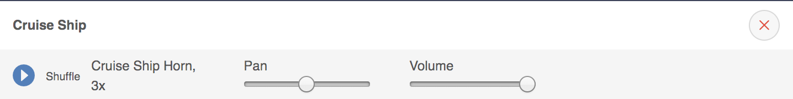
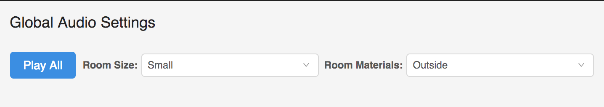

So at the end of October I came across a hackathon that a company called Product Hunt was hosting throughout November. [@_greg_smith](https://twitter.com/_greg_smith) and I have always talked about doing a project together and this seemed like the perfect incentive to get us started on something.

Now at the end of the hackathon, we are very pleased to present... a Soundscape Generator!

## The Idea

We were thinking of photos and what they're lacking. It's great to be able to look at pictures of moments and either imagine what it would be like, or remember what it *was* like to be there, but couldn't they be a bit more immersive? Well of course! What if you could hear what it was like as well?

Users could simply choose or upload a photo and a list of objects in the image would be created. Then after the press of a button the app could find audio clips appropriate for each of the objects. Finally, playing all those clips together would create a realistic soundscape for the image!

## The Tech

We decided to go about this by creating a [Flask](http://flask.pocoo.org/) app with [React](https://reactjs.org/) on the frontend and use [AWS Codestar](https://aws.amazon.com/codestar/) to run it on an EC2 instance.

### Image Scanning

We still needed a few more things though. First of all, how were we going to get the features from the images? Luckily [AWS Rekognition](https://aws.amazon.com/rekognition/) was perfect for this. By making one simple call to it we were able to get the features no problem.


def detect_labels(self, key, bucket=BUCKET, max_labels=10, min_confidence=80,
                  region="us-east-1"):
    rekognition = boto3.client("rekognition", region)
    rek_results = rekognition.detect_labels(
        Image={
            "S3Object": {
                "Bucket": BUCKET,
                "Name": key,
            }
        },
        MaxLabels=max_labels,
        MinConfidence=min_confidence,
    )
    labels = []
    for label in rek_results['Labels']:
        labels.append(label['Name'])
    return labels


### Sample Searching

Once we had the features the next step was to get the audio clips for them. Was there a sound library out there with an API? You bet there was. After a quick search we found [Freesound](http://www.freesound.org/) and it was just what we needed.

With the features returned by Rekognition we could query the Freesound library for clips that had those terms in their names.


function getSoundSearchResults(keyword) {
    const url = `https://freesound.org/apiv2/search/text/?query=${keyword}`
    let headers = new Headers();
    headers.append("Authorization", "Token <token>");
    return fetch(url, {headers})
        .then((response) => response.json())
        .then(json => json.results)
        .catch((err) => {
            console.error("ERROR", err);
            throw new Error(err);
        });
}


After retrieving the audio clips they could then each be streamed from Freesound either one at a time or all together. Don't like one of the clips? That's okay just hit the shuffle button and another result will be fetched!

### Room Settings

The last goal we had was to add an appropriate amount of effects to match the types of environments where pictures were taken. Google's [Resonance Audio](https://aws.amazon.com/rekognition/) just happened to fall into our laps thanks to a post on [Hacker News](https://news.ycombinator.com/) and boy we're glad it did! It provides the ability to add reverb, as well as gain control and panning for the audio clips. We do our best to guess the types of room materials in the pictures from the features returned by Rekognition but there is definitely room for improvement here.

## What's Next

### Video

Just as we were wrapping this hackathon project up, AWS announced at their re:Invent conference that Rekognition will now be supporting video! This is really exciting for us because we can very soon add that support to our app as well. With this option we have considered that video producers could even use our app to quickly create a soundscape to drop into a scene they're working on.

### Sharing

At the moment, users only have the ability to hop on the app and listen back to the results while they're there. We would love for people to export their creations and share them on social media as well.

## Conclusion

So that's our Soundscape Generator. It was a blast working on it and thanks to Product Hunt for the extra incentive as well as the helpful resources. You can check out the app [here](http://ec2-34-231-21-21.compute-1.amazonaws.com/) and our GitHub repo is [over here](https://github.com/amaclean199/soundscape-generator). If you have any comments or questions about it please feel free to reach out :)
